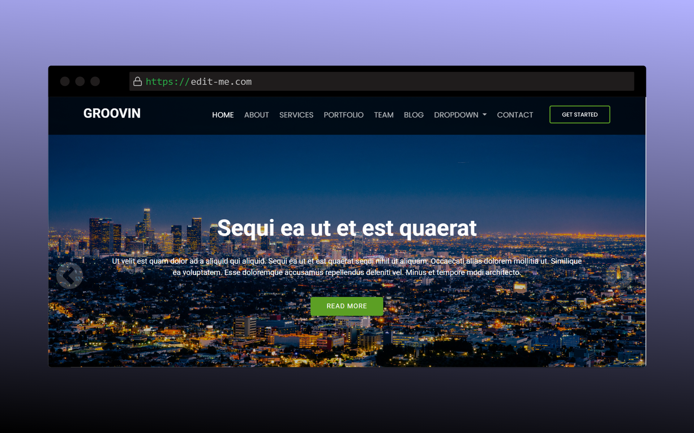

# Groovinn



## About Groovinn

Groovinn is a modern web application designed to provide users with an immersive musical experience. Our platform offers a sleek interface to discover, enjoy, and share music in a user-friendly environment.

## Features

- Responsive design for all device types
- Interactive music player interface
- Playlist creation and management
- Artist and album discovery
- User profile customization
- Social sharing capabilities

## Technologies Used

- HTML5
- CSS3
- JavaScript
- Bootstrap framework
- Font Awesome icons
- Responsive design principles

## Getting Started

1. Clone the repository:
   ```
   git clone https://github.com/yourusername/groovinn.git
   ```

2. Open `index.html` in your browser to view the website

3. No additional installation required as this is a front-end project

## Project Structure

- `/assets/` - Contains all resources used in the project
  - `/css/` - Stylesheet files
  - `/js/` - JavaScript files
  - `/images/` - Image resources
  - `/fonts/` - Custom fonts (if applicable)
- `index.html` - Main entry point for the application

## Browser Compatibility

- Chrome (latest)
- Firefox (latest)
- Safari (latest)
- Edge (latest)

## Contributing

If you'd like to contribute to this project, please follow these steps:

1. Fork the repository
2. Create a new branch (`git checkout -b feature/amazing-feature`)
3. Make your changes
4. Commit your changes (`git commit -m 'Add some amazing feature'`)
5. Push to the branch (`git push origin feature/amazing-feature`)
6. Open a Pull Request

## License

This project is licensed under the MIT License - see the LICENSE file for details.

Project Link: [https://github.com/beus421/groovin](https://github.com/beus421/groovin)

